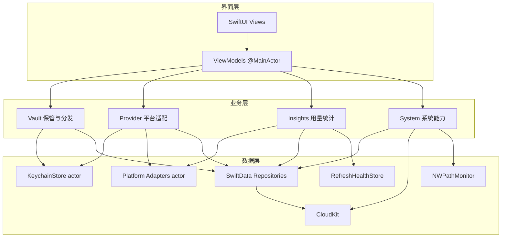
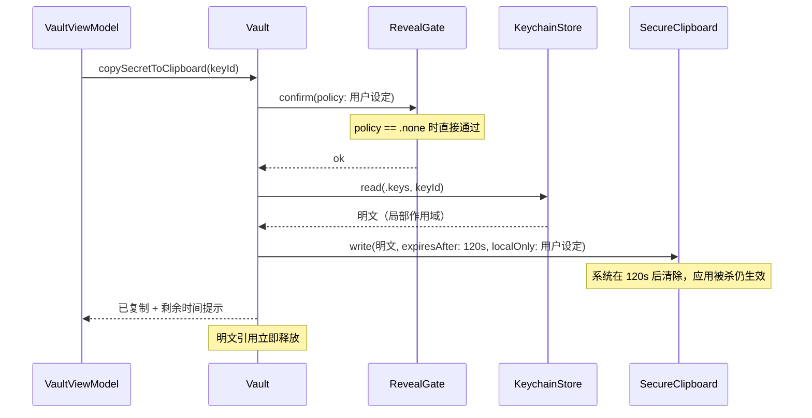
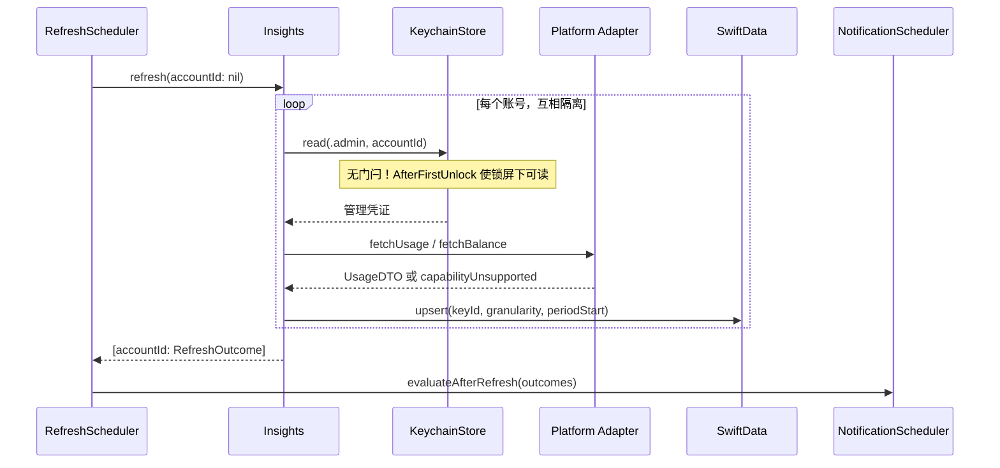

# Implementation Plan: ApiRelay（架构总纲 + V1 实现计划）

**Branch**: `v1` | **Date**: 2026-08-04 | **Spec**: [spec.md](./spec.md)

**Input**: Feature specification from `specs/001-key-vault/spec.md`

## 阅读须知：本文的双重身份

本文既是**全产品的架构总纲**，也是**V1 的实现计划**：

- **架构、目录结构、依赖规则、数据模型引用**部分覆盖全三阶段。必须如此——架构一次性设计到位，
  V2/V3 才能只做增量而非重写，这是产品负责人明确要求避免的返工。
- **技术栈、性能目标、风险清单**中标注了阶段归属的条目，按标注理解。
- **V1 实际要做什么，以 [tasks.md](./tasks.md) 为准**；阶段范围以 [ROADMAP.md](../ROADMAP.md) 为准。

**V1 的决定性边界：完全不联网调用任何上游平台接口。** 因此下文架构图中的
`Business/Provider/`、`Business/Insights/`、`Data/Network/` 三块在 V1 **不创建**——
它们属 V2。保留在图中是为了让 V1 的目录划分从一开始就给它们留好位置。

## Summary

本文档描述**全产品架构**与 **V1 实现约束**。

**产品最终形态**：密钥保险库 + 分发助手 + 用量看板 +（**V3**）用户自建中转。
上架节奏（DC-009）：Stage1→**1.0.0** / Stage2→**2.0.0** / Stage3→**3.0.0**。
本文 V1 范围**不含**中转实现与入口；也不含用量/探活的实现与入口。

五件事构成全产品闭环：

1. **保管**（V1→1.0.0）：各平台的 API 密钥明文存 Keychain，经 iCloud 钥匙串在用户自己的 Apple 设备间同步。
2. **分发**（V1→1.0.0）：用户把某把密钥指派给某个使用方工具（VS Code、OpenCode…），经**剪贴板**取出明文。
   **产品的职责边界终止于系统剪贴板**——不与任何外部工具集成，不代写配置文件。
3. **权益**（V1→1.0.0）：免费版共 3 把密钥；一档买断解锁无限密钥。
4. **统计与关系图等**（V2→2.0.0）：拉取上游平台的用量与余额；双视角呈现；探活等。
5. **中转**（V3→3.0.0）：用户自建 Cloudflare Worker；下游配置稳定 + 自主逐笔统计。

技术路线：**Swift 6 / SwiftUI / 零第三方 SDK / Mac Catalyst 一期覆盖 Mac**（DC-019、DC-020）。
架构为**三层纵向解耦 + 四模块横向隔离**（保管分发、平台适配、用量统计、系统能力）。
V1 只创建 Vault + System 两模块的实现目录；Provider / Insights / Network 在架构图中预留位置，
**V1 不创建、不注入 UI**。

**本期最关键的一条技术约束**：Keychain 的 iCloud 同步（`kSecAttrSynchronizable`）与系统级生物识别
ACL（`kSecAttrAccessControl`）**互斥**。因产品要求跨设备同步，门闩改为**应用层**实现
（`LAContext`）。这弱于系统级强制，产品文案 MUST NOT 宣称「系统级强制」。详见
[research.md](./research.md) §1。

Phase 0 调研见 [research.md](./research.md)；Phase 1 数据模型见 [data-model.md](./data-model.md)、
接口契约见 [contracts/](./contracts/)、验收指南见 [quickstart.md](./quickstart.md)。

## Technical Context

**Language/Version**: Swift 6（Xcode 16+，Swift Concurrency；`SWIFT_DEFAULT_ACTOR_ISOLATION = MainActor`）

**Primary Dependencies**: 无第三方 SDK。Apple 原生框架：SwiftUI、SwiftData、CloudKit、Security、
LocalAuthentication、CryptoKit、UIKit（`UIPasteboard`）、BackgroundTasks、UserNotifications、StoreKit 2

**Storage**: Keychain（密钥明文，iCloud 钥匙串同步）+ SwiftData/CloudKit Private DB（元信息与用量快照）
+ UserDefaults（刷新健康度）

**Testing**: XCTest（单元，target `ApiRelayTests`）+ XCUITest（主流程，可选）

**Target Platform**: iOS 18.0+；macOS 15.0+ via **Mac Catalyst**（一期；DC-019 / DC-020）

**Project Type**: 原生 SwiftUI 跨端 App（single target + Catalyst）

**Performance Goals**:

- 密钥列表加载 < 200ms（本地 SwiftData，100 条以内）
- 「复制密钥」从点击到剪贴板就绪 < 1.5s（含门闩交互时间）
- 单平台用量刷新 < 5s（网络正常）；刷新期间 UI 不阻塞
- UI 主线程无 Keychain 与网络阻塞

**Constraints**:

- 明文只存在于 Keychain、单次操作的局部作用域、以及剪贴板（限时）三处
- 明文 MUST NOT 进入 SwiftData / CloudKit / 日志 / 崩溃报告
- 离线可用：保管与分发全功能可用，仅统计降级为「显示上次数据 + 时间戳」
- HTTPS only
- 剪贴板默认 2 分钟自动清除，且可禁用通用剪贴板

**Scale/Scope**:

- 单用户个人场景，多设备（iPhone + Mac）
- 免费 3 把密钥 / 买断无限
- 用量为**周期聚合快照**（非逐笔），数据量小；逐笔明细属阶段三

## Constitution Check

*GATE: Must pass before Phase 0 research. Re-check after Phase 1 design.*

| 原则 | 方案对齐 | 状态 |
|------|----------|------|
| I. 三层架构解耦 | UI → Business Protocol → Data；Data 无 SwiftUI | ✅ Pass |
| II. 模块化横向隔离 | 四模块仅经 protocol 通信；新增平台=新增 adapter | ✅ Pass |
| III. Apple 原生优先 | 零第三方 SDK；剪贴板限时清除用系统 `.expirationDate` 而非自建计时器 | ✅ Pass |
| IV. 跨平台复用 | Business + Data 100% 共享；UI 分平台适配 | ✅ Pass |
| V. 故障隔离 | 刷新结果**按账号**返回；单平台失败不影响其他平台与保管功能 | ✅ Pass |
| VI. 向下兼容 | additive-only schema；阶段三三个扩展点均为枚举加值或新增实体 | ✅ Pass |
| VII. 密钥安全 | Keychain only；列表不展示密钥片段；去重为本机 Keychain 相等比较；剪贴板为条件许可；iCloud 钥匙串同步已获宪法明许 | ⚠️ **见下方说明** |
| VIII. 身份确认门闩 | 应用层 `LAContext`；查看与复制**共用一个门闩**；自动刷新不触发门闩 | ⚠️ **见下方说明** |
| IX. 数据真实性 | 未知一律 nil 且显式标注，禁止以 0 代替；平台数字与本产品估算分字段存储 | ✅ Pass |
| 平台体验标准 | SwiftUI 系统组件、Dynamic Type、Dark Mode | ✅ Pass |
| **设置列表行**（v2.4.0 新增） | 仅子页行显示 〉；顺序 `标题　当前值　ⓘ　〉`；本页控件无 〉 | ✅ Pass |
| **界面呈现**（v2.5.0 新增） | 设置下一层推入；购买/确认用 sheet；本页控件不另开界面 | ✅ Pass |
| **无障碍**（v2.2.0 新增；v2.6.0 列表不读片段） | Dynamic Type；VoiceOver 标签；列表/详情不朗读密钥片段；门闩后明文区可逐字符朗读（FR-059） | ✅ Pass（T060） |
| **本地化**（v2.1.0 新增） | **开发语言为英语** + `zh-Hans` 附加；String Catalog + 语义化 key；Apple 官方译名；法律文本人工双语 | ✅ Pass（T005a / T059a / T059b） |
| 稳定性与兼容 | iOS 18.0 / macOS 15.0；Swift 6；async/await；`DiagnosticsReporting` hook | ✅ Pass（T002） |
| 安全要求 | HTTPS、gitignore 敏感文件 | ✅ Pass |
| 开发纪律 | 分支 `v1` / `v1.N`、上架合并 `main` + tag `release/N.0.0`；按模块提交；提交前 `xcodebuild build` 通过 | ✅ Pass |

### ⚠️ VII / VIII 的偏差说明（非豁免，是能力上限）

宪法第 VIII 条要求门闩「使用 `LAContext` 调用 Face ID / Touch ID」——本方案**满足**该条文。
但需明确记录一项**能力上限**：因 `kSecAttrAccessControl` 与 `kSecAttrSynchronizable` 互斥，
门闩无法做到 Keychain 级强制，只能在应用层实现。这意味着：

- 攻击者若能在已解锁设备上运行经改造的应用二进制，理论上可绕过应用层门闩直接读取 Keychain。
- 该风险由 iOS 的代码签名与沙盒机制缓解，但**弱于**系统级 ACL。
- 因此产品与 App Store 文案 MUST NOT 使用「系统级强制」「无法绕过」等表述（宪法 IX 数据真实性）。

这不是设计违规，无需 Complexity Tracking 豁免；是取舍已被产品负责人明示裁决（DC-006）后的记录。

**Post-Design Re-check（2026-08-05；2026-08-11 复核）**：设计层面全部通过。剩余 ⚠️ 仅 VII/VIII 能力上限说明。
工程配置项与 **T014b（Checkpoint 2b）** 已完成。上架前仍阻塞：**T063–T066**、**T062**（需授权）。

## Project Structure

### Path Conventions

> **Spec Kit 根目录** = `ApiRelay/`（含 `.specify/` 与 `ApiRelay.xcodeproj`）。
> 下文所有路径均相对于 Spec Kit 根目录；换算到 Git 仓库根目录时加前缀 `ApiRelay/`。

| 类型 | 路径模式 | 示例（Spec Kit 根相对） |
|------|----------|-------------------------|
| App 源码（Xcode synchronized group） | `ApiRelay/…` | `ApiRelay/App/ApiRelayApp.swift` |
| Entitlements / Info.plist | `ApiRelay/…` | `ApiRelay/ApiRelay.entitlements` |
| 单元测试 | `ApiRelayTests/…` | `ApiRelayTests/KeychainStoreTests.swift` |
| 本地存储（非 SwiftData） | `ApiRelay/Data/Local/…` | `ApiRelay/Data/Local/RefreshHealthStore.swift` |
| Feature 文档 | `specs/001-key-vault/…` | `specs/001-key-vault/plan.md` |
| 项目宪法 | `.specify/memory/constitution.md` | — |

### Documentation (this feature)

```text
specs/001-key-vault/
├── plan.md              # This file
├── research.md          # Phase 0
├── data-model.md        # Phase 1
├── quickstart.md        # Phase 1
├── contracts/           # Phase 1
│   ├── module-interfaces.md
│   └── platform-adapters.md
├── checklists/
│   └── requirements.md
├── spec.md
└── tasks.md             # Phase 2
```

### Source Code (Spec Kit root)

```text
ApiRelay/                              # Xcode synchronized root group
├── App/
│   ├── ApiRelayApp.swift
│   ├── RootTabView.swift              # V1：两个 Tab（密钥 / 设置）；用量 Tab 属 V2，本期不加
│   └── DependencyContainer.swift
├── UI/
│   ├── Vault/                         # 平台与密钥列表、表单、明文查看、复制
│   ├── Insights/                      # （V2）双视角用量、余额、能力限制说明
│   ├── Settings/                      # 门闩策略、剪贴板、付费墙、隐私；V2 再追加刷新/提醒
│   └── Shared/                        # 通用组件、Mac Commands
├── Business/
│   ├── Vault/                         # 保管与分发
│   │   ├── KeyVaultServing.swift
│   │   ├── KeyVaultService.swift
│   │   ├── RevealGateServing.swift
│   │   ├── RevealGate.swift
│   │   ├── ClipboardServing.swift
│   │   ├── SecureClipboard.swift
│   │   └── KeyHealthServing.swift     # V1 仅协议；V2 实现（DC-028）
│   ├── Provider/                      # 平台侧签发与作废
│   │   ├── ProviderKeyServing.swift
│   │   ├── ProviderKeyService.swift
│   │   └── PlatformCapabilityTable.swift   # 静态能力矩阵，不持久化
│   ├── Insights/                      # 用量与统计
│   │   ├── UsageServing.swift
│   │   ├── UsageService.swift
│   │   ├── UsageRollup.swift          # 双视角共用的唯一聚合实现
│   │   └── CostEstimator.swift
│   └── System/
│       ├── EntitlementService.swift
│       ├── PreferencesService.swift
│       ├── SecureBackupService.swift
│       ├── DataLifecycleService.swift # 清除全部数据（FR-061）
│       ├── RefreshScheduler.swift
│       └── NotificationScheduler.swift
├── Data/
│   ├── Keychain/
│   │   └── KeychainStore.swift        # actor；MUST NOT 设置 kSecAttrAccessControl
│   ├── SwiftData/
│   │   ├── Models/
│   │   ├── Schema.swift               # synced + local 双配置
│   │   └── Repositories/
│   ├── Local/
│   │   └── RefreshHealthStore.swift   # UserDefaults，按账号隔离
│   └── Network/
│       ├── Adapters/
│       │   ├── OpenRouterAdapter.swift
│       │   ├── OpenAIAdapter.swift
│       │   ├── AnthropicAdapter.swift
│       │   └── DeepSeekAdapter.swift
│       ├── HTTPClient.swift
│       └── NetworkMonitor.swift
└── Shared/
    ├── ApiRelayError.swift
    ├── DiagnosticsReporting.swift
    └── DTOs/

ApiRelayTests/
```

**Structure Decision**: 单 Xcode project、单 app target（+ Mac Catalyst），按
**App / UI / Business / Data / Shared** 物理分目录映射三层架构。Business 各模块含
`Protocol` + `Service` 成对文件，便于 UI 依赖抽象与单测 mock。工程使用
`PBXFileSystemSynchronizedRootGroup`，新增子目录自动纳入 target，无需手改 `project.pbxproj`。

**每平台一个 Adapter 文件**是宪法第 II 条的落点：新增平台不改动既有代码。

## Complexity Tracking

> 无宪法豁免项。VII/VIII 的应用层门闩是**平台能力上限**而非架构妥协，已在 Constitution Check
> 中披露，不占用豁免额度。

| Violation | Why Needed | Simpler Alternative Rejected Because |
|-----------|------------|-------------------------------------|
| — | — | — |

---

## 设计附录（Design Appendix）

> 凡与 [research.md](./research.md)、[data-model.md](./data-model.md)、[contracts/](./contracts/)
> 重叠的细节，**以那些文档为准**，本附录不复述具体常量与字段。

### A1. 技术栈选型

| 层次 | 选型 | 理由 |
|------|------|------|
| 语言 | **Swift 6**（`SWIFT_VERSION = 6.0`） | DC-019；跨 actor 传递（Keychain / Adapter）必须从一开始用严格并发检查 |
| UI | SwiftUI | iOS/Catalyst 复用率高，符合 HIG |
| 密钥存储 | Security.framework Keychain（synchronizable） | 宪法 VII；跨设备同步靠系统 |
| 身份门闩 | LocalAuthentication `LAContext` | 与同步兼容的唯一方案（research §1） |
| 剪贴板 | `UIPasteboard` + `.expirationDate` + `.localOnly` | 系统级限时清除，应用被杀仍生效 |
| 业务存储 | SwiftData | iOS 17 官方 ORM，CloudKit 集成成熟 |
| 同步 | CloudKit Private DB | 元信息多端同步，无需自建后端 |
| 网络 | URLSession + async/await | 仅普通 REST 请求，无需流式 |
| 加密备份 | CryptoKit AES-GCM | 付费能力，原生实现 |
| 自动刷新 | 前台 Task + BackgroundTasks | 前台精确、后台机会性 |
| 权益 | StoreKit 2 | 苹果官方 IAP |
| Mac 一期 | Mac Catalyst | `UIPasteboard` 语义一致，双端行为统一 |

**明确不引入**：KeychainAccess、Alamofire、Realm 等第三方库（宪法 III）。

### A2. 架构设计



**关键依赖说明**：`Insights` 读取管理类凭证走 `KeychainStore`（经 `Provider` 提供的取凭证方法），
**且不经过 `RevealGate`**——自动刷新不触发门闩（宪法 VIII、research §7）。这条例外必须在代码中
以显式命名体现（如 `readCredentialForAutomatedRefresh`），避免后续维护者误加门闩导致后台刷新失效。

#### 核心时序 1：复制一把密钥给使用方工具



#### 核心时序 2：按间隔自动刷新用量



### A3. 数据模型

**权威定义见 [data-model.md](./data-model.md)**。Plan 层面的三条结构性决策：

- **明文与元信息物理分离**：Keychain 存明文（iCloud 钥匙串同步），SwiftData/CloudKit 只存元信息与快照。
- **用量为幂等 upsert 的周期快照**，键为 `(keyId, granularity, periodStart)`。重复拉取覆盖而非追加，
  避免 CloudKit 上出现重复计数。
- **双视角单一数据源**：平台维度与使用方维度读同一批 `APIKeyRecord`、走同一个聚合函数，
  仅分组键与归集规则不同。这是 SC-005（两维度汇总必须自洽）的结构性保证，而非靠测试保证。
- **指派关系为多对多**（`KeyAssignment` 中间表）。由此产生一条 V2 必须遵守的统计口径：
  **共享密钥（指派给 ≥2 个工具）的用量归入独立的「共享密钥」小计，禁止摊分、禁止重复计数**
  ——上游平台只按密钥给数据，无法拆分同一把密钥在不同工具间的消耗。摊分即编造（宪法 IX）。
  这个限制只有 V3 的中转能真正解除。

### A4. 双端适配方案

一期 Mac Catalyst：Business + Data 层 **100%** 共享，零 `#if os`。单 iOS target 开启
`SUPPORTS_MACCATALYST`。

| Mac 专项适配（仅 UI 层） | 实现要点 |
|--------------------------|----------|
| 窗口尺寸 | `defaultSize(900, 700)`；最小 800×600 |
| 菜单栏 | `Commands`：Settings ⌘,、New Key ⌘N、Quit；**Refresh ⌘R 属 V2**（T052） |
| 鼠标交互 | 列表 hover 高亮；右键菜单（复制、查看、删除） |
| 快捷键 | ⌘C 复制选中密钥（仍过门闩）、⌘W 关闭 sheet |
| 生物识别文案 | Mac 多为 Touch ID，文案须由 `availableBiometry()` 动态决定 |

**Catalyst 下的两个已知差异**，实现时须实测：
`UIPasteboard.expirationDate` 在 macOS 剪贴板上的落地行为；无 Touch ID 的 Mac 上
`biometricOnly` 档必须自动禁用。

### A5. 系统权限与工程配置

| 能力 | 用途 |
|------|------|
| iCloud / CloudKit | SwiftData 多端同步 |
| Keychain Sharing | 固定 access group，MVP 即配置以避免日后迁移已存条目（宪法 VI） |
| Face ID / Touch ID | `NSFaceIDUsageDescription` |
| App Groups | `group.com.apirelay.shared` |
| Background App Refresh | `BGAppRefreshTask`，用量与余额刷新 |
| User Notifications | 余额不足 / 密钥失效 / 每周摘要 |
| Network Client | 上游平台 API |

`ApiRelay/ApiRelay.entitlements` 目标字段：

```xml
<key>com.apple.developer.icloud-container-identifiers</key>
<array>
  <string>iCloud.com.apirelay.ApiRelay</string>
  <!-- 等价写法：iCloud.$(CFBundleIdentifier)；Bundle ID 定稿为 com.apirelay.ApiRelay -->
</array>
<key>com.apple.security.application-groups</key>
<array>
  <string>group.com.apirelay.shared</string>
</array>
<key>keychain-access-groups</key>
<array>
  <string>$(AppIdentifierPrefix)group.com.apirelay.shared</string>
</array>
```

#### 不可逆工程标识符（已定稿，写业务代码前不得改）

| 项 | 定稿取值 | 依据 |
|----|----------|------|
| Bundle Identifier | `com.apirelay.ApiRelay` | DC-018 |
| App Group | `group.com.apirelay.shared` | DC-018 |
| Keychain access group | `$(AppIdentifierPrefix)group.com.apirelay.shared` | DC-018 |
| Keychain Service（keys / admin / masterpw） | `com.apirelay.keychain.keys` / `.admin` / `.masterpw` | research §1 |
| **iCloud 容器** | **`iCloud.com.apirelay.ApiRelay`** | DC-018；= `iCloud.$(CFBundleIdentifier)`。**废弃别名** `iCloud.com.apirelay.app` |
| ModelConfiguration 名 | `"synced"` / `"local"` | data-model §1 |
| 最低系统版本 | iOS 18.0 / macOS 15.0 | DC-019 |
| Swift 语言模式 | 6.0 | DC-019 |
| Mac 形态 | Mac Catalyst（不可迁原生 macOS target） | DC-020 |

#### 内购不可逆配置（FR-062 / DC-023，已定稿）

| 项 | 定稿取值 | 说明 |
|----|----------|------|
| V1 买断产品 ID | `com.apirelay.iap.unlimited_keys` | 非消耗型；创建后不可删、不可复用 |
| V3 中转档产品 ID（预留，V1/V2 **不创建**） | `com.apirelay.iap.relay` | 独立非消耗型；MUST NOT 把买断改成订阅 |
| 家庭共享（Family Sharing） | **开启** | 一旦开启不可关闭；一次性买断适合家庭共享 |
| StoreKit Configuration 本地 ID | 与上表产品 ID 一字不差 | T044 / T044a |

#### 工程现状与待办（2026-08-05 刷新）

| 项 | 状态 | 备注 |
|----|------|------|
| iCloud Container / App Group / Keychain group | ✅ | `iCloud.com.apirelay.ApiRelay`、`group.com.apirelay.shared` |
| Mac Catalyst / iOS 18 / macOS 15 / Swift 6 | ✅ | T002 |
| Bundle ID `com.apirelay.ApiRelay` | ✅ | T002a |
| `PrivacyInfo.xcprivacy` + 加密出口声明 | ✅ | T005；FR-045 / FR-058 |
| development language `en` + `zh-Hans` / String Catalog | ✅ | T005a |
| ApiRelayTests | ✅ | T003 |
| `ENABLE_USER_SELECTED_FILES` / MainActor 隔离 + Keychain `actor` | ✅ | 已落地 |
| 内购产品 ID / 家庭共享定稿（工程侧） | ✅ | T044a；Connect 侧创建随上架 |
| CloudKit Production Deploy（T014b） | ✅ | **Checkpoint 2b** 通过（2026-08-05）；8 表 + §7.1 预留字段已在 Production |
| 商店元数据 / 隐私问卷 / 截图 / 提交清单 | ⬜ | **T063–T066** |
| `main` + tag `release/1.0.0` + 提交审核 | ⬜ | **T062**（需授权；前置 2b + T063–T066） |
| BGTaskScheduler 标识 | V2 | 本期不做 |

Developer Portal 侧：若尚未勾选 iCloud(CloudKit)+App Group，须在 T014b 人工步骤中完成。

### A6. 风险与兜底

| 风险 | 影响 | 兜底方案 |
|------|------|----------|
| **应用层门闩弱于系统级 ACL** | 越狱/改包设备上可绕过 | 已明示披露；文案禁用「无法绕过」表述；高价值场景建议用户不开启同步 |
| iCloud 钥匙串同步延迟 | 新设备取不到明文 | `secretAvailable = false` 的显式状态 + 提示等待或手动补录 |
| 剪贴板 `.expirationDate` 在 Catalyst 行为差异 | 明文残留 | 应用内 `Timer` 兜底 + 清除前校验内容仍是本产品写入的那份 |
| 后台刷新不被系统调度 | 提醒延迟 | 文案表述为「下次刷新时检查」；提供手动刷新；前台进入时立即刷新 |
| OpenAI/Claude 的 `api_key_id` 无法自动对应本地密钥 | 用量归属不明 | 提供手动关联流程；未关联用量归入「未关联」而非丢弃 |
| **共享密钥的用量无法归属到单个工具** | 用户以为统计不准 | 单列「共享密钥」小计 + 明确说明成因；引导需要精确归属的用户走 V3 中转 |
| 新增四个上游平台（Google/百炼/火山/硅基流动）能力未调研 | V2 排期不确定 | V1 只需保管，不受影响；V2 开始前先做能力调研，未调研完成前一律标记为不支持 |
| DeepSeek 无按密钥用量 | 用户预期落空 | 该平台密钥的用量位显式说明「平台不支持」；上架说明中提前告知 |
| Claude 缓存 token 单价复杂 | 估算失真 | 缓存 token 只展示数量、不计入估算，并标注口径 |
| 平台侧创建成功而本地保存失败 | 出现无法取回明文的孤儿密钥 | 不回滚平台侧；抛专用错误 + 不可忽略的指引（FR-010） |
| 退款/降级后超出免费额度 | 数据合规投诉 | 超额密钥只读保留，可看可删，不强制清空（FR-029） |
| StoreKit 审核 | IAP 拒审 | 付费逻辑先用 Debug override 验收；必须实现「恢复购买」（FR-028） |
| MainActor 默认隔离 | Data 层误跑主线程 | Keychain / Adapter 显式 `actor`（contracts §0） |
| CloudKit 只在 Development 建表未 Deploy Production | TestFlight 同步失败 / 字段丢失 | Phase 2 T014b 硬门槛（FR-063） |
| 无「清除全部数据」入口 | 隐私问卷含糊；iCloud 残留密钥 | FR-061 / DC-026 |
